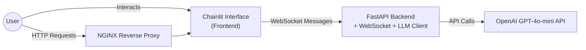
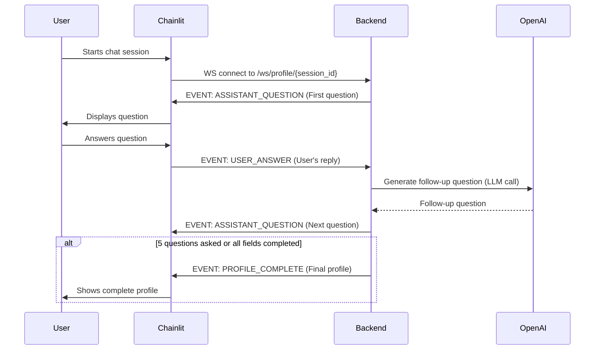

# AI-Powered Wellness Profiling Platform

---

## Project Overview

This project is a simplified AI-powered wellness profiling platform designed to interactively collect user health and lifestyle data via a real-time chat interface.

- **Backend:** FastAPI with WebSocket support for real-time communication
- **Frontend:** Chainlit-based interface for conversational user interaction
- **LLM Integration:** OpenAI GPT-4o-mini for adaptive follow-up question generation
- **Data Handling:** Pydantic for data validation and intelligent merging of partial user responses
- **Containerized:** Docker Compose with backend, frontend, and NGINX proxy containers

---

## Architecture Overview




## Sequence Diagram: WebSocket Interaction Flow



## 🚀 Setup & Installation

### 📋 Prerequisites

Make sure you have the following installed:

- [Docker](https://docs.docker.com/get-docker/)
- [Docker Compose](https://docs.docker.com/compose/)

Also, create a `.env` file in the **project root** or **home directory** with the following content:

```env
OPENAI_API_KEY=your_openai_api_key
FAST_API_PORT=3000
CHAINLIT_PORT=8000
HOST=localhost
IS_DEV=1
```


## Running the Application

### 1. Clone the repository:
```bash
git clone <repo-url>
cd <repo-folder>
```

### 2. Build and start the containers:
```bash
docker-compose up --build -d
```

### 3. Open your browser and navigate to:
```bash
http://localhost
```
The Chainlit interface will launch, allowing you to interact with the wellness profiling chatbot.


## Usage Details

### WebSocket API

**Endpoint:**  
`ws://chatbot-apis:{FAST_API_PORT}/ws/profile/{session_id}`

### WebSocket Events

| Event              | Description                                | Direction         |
|--------------------|--------------------------------------------|-------------------|
| `INIT_PROFILE`     | Initiate profiling session                 | Client → Server   |
| `ASSISTANT_QUESTION` | Assistant sends adaptive follow-up question | Server → Client   |
| `USER_ANSWER`      | Client sends user's answer                 | Client → Server   |
| `PROFILE_COMPLETE` | Final profile collection is complete       | Server → Client   |


### User Flow

The assistant asks up to 5 adaptive questions to collect the following information:

- **Age, Gender**
- **Daily Activity Level**
- **Dietary Preference**
- **Sleep Quality**
- **Stress Level**
- **Health Goals** (free-text, full sentence)

### Notes:

- The LLM dynamically generates questions based on prior answers and the remaining fields.
- User responses are intelligently merged and validated via **Pydantic schemas**.
- Questions may **combine related fields** where appropriate (e.g., *Age + Gender*).


## Technical Details

### Backend

- FastAPI serves REST and WebSocket endpoints.
- Uses Pydantic models for:
  - Validating user input.
  - Merging partial profile updates without overwriting unless explicitly changed.
- Maintains session state in-memory per WebSocket connection.

### LLM Integration

- Uses OpenAI's GPT-4o-mini model.
- Custom prompts guide the LLM to:
  - Extract structured profile data from free-text answers.
  - Generate friendly, adaptive follow-up questions.
  - Respect domain constraints (e.g., allowed values for fields, 5-question limit).

## Troubleshooting & Notes

- Ensure `.env` variables are set correctly before starting containers.
- WebSocket timeout in Chainlit interface is **60 seconds**; user input must be timely.
- Docker Compose includes an **NGINX** container for reverse proxying frontend/backend.
- The app currently uses **in-memory session storage**; consider Redis or a database for production.
- Logs and errors from backend and Chainlit containers can be viewed via:

```bash
docker-compose logs chatbot-apis
docker-compose logs chainlit-interface
```

## 🔮 Future Work & Improvements

### Reduce LLM API Usage:
- Cache repeated patterns and responses.
- Use rule-based templates for common questions.
- Explore lightweight local LLMs for offline use.

### Session Persistence:
- Store sessions in Redis/PostgreSQL for reconnection and history.

### Role-Based Profiling:
- Customise profiles for developers, employees, fitness users, etc.

### Analytics Dashboard:
- Visualise user data and profiling trends.

### Multilingual Support:
- Add translation for non-English users.

### Profile Export:
- Allow profile download as JSON or PDF.
